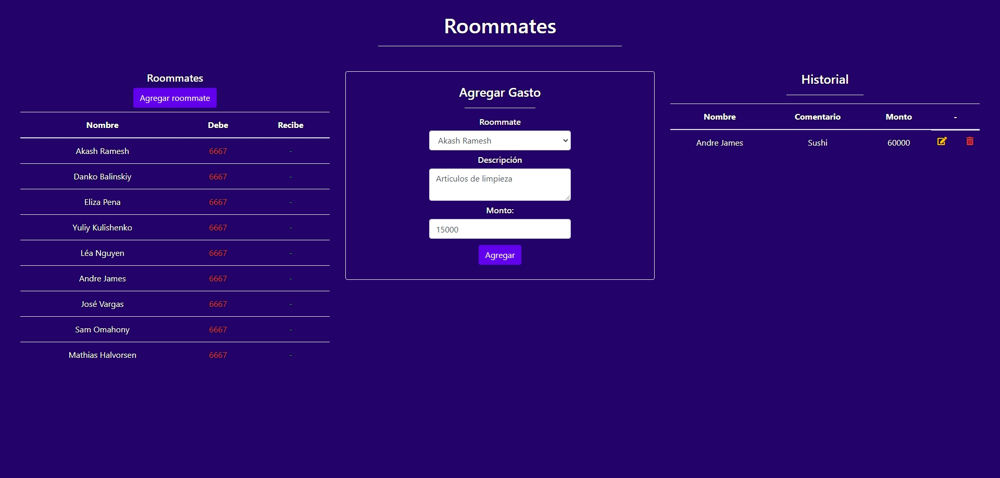

# Desafío evaluado - Roommates

Es bien sabido que entre las mejores recomendaciones que un programador amateur puede
recibir para mejorar sus habilidades es “crear aplicaciones”, sin darle tanta importancia a la
temática a elaborar, sino que solo basta con un problema para desarrollar una solución digital.
En esta prueba deberás crear un servidor con Node que sirva una interfaz HTML  y cuya temática está basada en el registro
de gastos entre roommates.
Además deberás servir una API REST que permita hacer lo siguiente:

  - Almacenar roommates nuevos ocupando random user.
  - Devolver todos los roommates almacenados.
  - Registrar nuevos gastos.
  - Devolver el historial de gastos registrados.
  - Modificar la información correspondiente a un gasto.
  - Eliminar gastos del historial.

